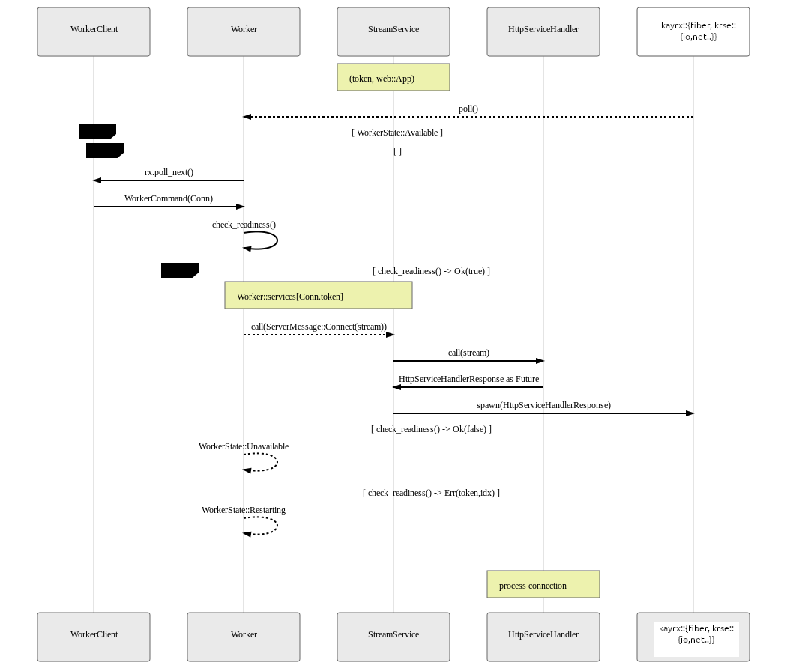

# HttpServer

## HttpServer初始化

下面是HttpServer初始化的示意图，它发生在以下代码上

```rust
#[kayrx::main]
async fn main() -> std::io::Result<()> {
    HttpServer::new(|| {
        App::new()
            .route("/", web::to(|| HttpResponse::Ok()))
    })
    .bind("127.0.0.1:8088")?
    .run()
    .await
}
```


## 连接生命周期

服务器已经开始听所有`sockets`，`Accept`和`Worker`是负责处理传入的客户端连接的两个主要循环。

一旦接受连接，应用程序级协议处理就会在由`Worker`产生协议特定的`Dispatcher`循环中发生.

> 请注意，以下图表仅概述了路径方案。


## 请求循环

> 请求循环的大多数代码实现都位于`kayrx::web`和`kayrx::http`中


## `Accept`循环

> 大多数代码实现都驻留在`kayrx::kcore`中的Accept


## `Worker`循环

> 大多数代码实现都驻留在`kayrx::kcore`中的Worker

